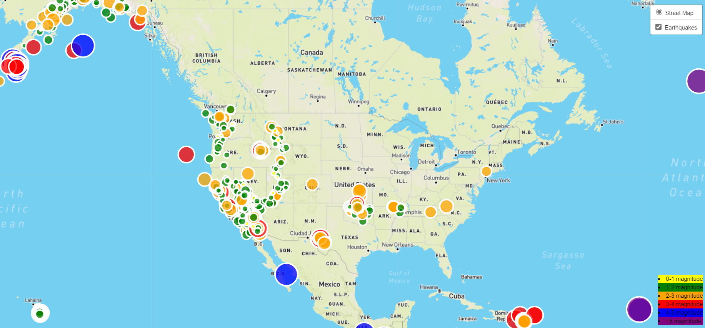
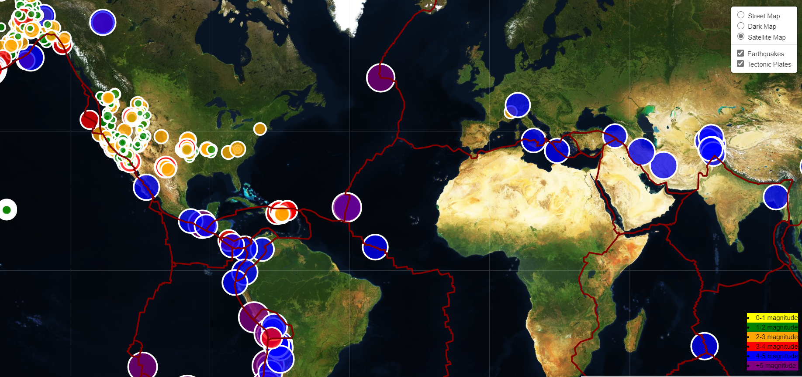

# leaflet-challenge

Project Description

The task is to retrieve earthquake data from the USGS website and plot it using leaflet. The data was 
plotted on a street map tile and was marked by colored circles showing increased magnitude by color c
hange. Also, the circles were sized according to magnitude. Tectonic plate data was retrieved and plotted 
on the same map. A dark map layer and satellite layer was added with layer control. Both data sets were 
also controlled by layer control. There appears to be correlation between plate boundaries and earthquakes. 
There also appears to be a correlation between plate boundaries and magnitude.

Tools Required

JavaScript, 
HTML, 
CSS, 
leaflet.js, 
USGS data

Instructions

• Import earthquake data from the USGS site for the last seven days 
• Create a street map using leaflet  
• Loop through features array and create markers to show magnitude 
• Include legend and layer control 
• Overlay tectonic plate data to show correlation with earthquakes and tectonic plate location 

Files

config.js – stores ape key for Map API
logic2.js - contains all leaflet code for creating maps with overlays and markers.
styles.css – contains styles for HTML
index.html – contains code to display webpage and logic2.js

Results

The data was plotted on a street map tile and was marked by colored circles showing increased magnitude by color 
change. Also, the circles were sized according to magnitude. Tectonic plate data was retrieved and plotted on the 
same map. A dark map layer and satellite layer was added with layer control. Both data sets were also controlled 
by layer control. There appears to be correlation between plate boundaries and earthquakes. There also appears 
to be a correlation between plate boundaries and magnitude.

Earthquake Map

Tectonic Plate Map

!
